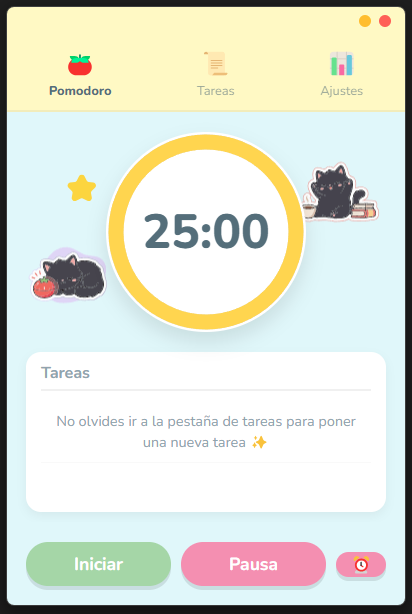
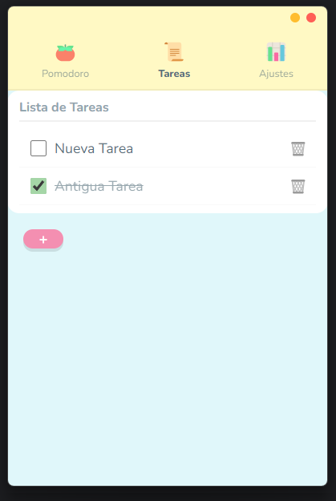
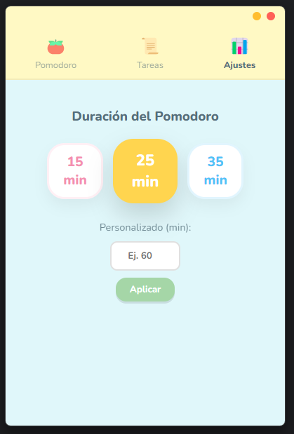

# Cute Pomodoro 🍅

A super cute, pastel-themed Pomodoro timer application built with Electron. Inspired by soft, friendly aesthetics to make productivity a little more delightful.

## Features ✨

- **Pastel Aesthetic**: Soft colors, rounded UI, and cute interactions.
- **Custom Timer**:
  - Preset durations: 15, 25, 35 minutes.
  - Custom duration input.
  - **Quick Add**: Easily add +5 minutes to your current session.
- **Task Management**:
  - Integrated To-Do list.
  - **Focus Mode**: Sees only the top 2 incomplete tasks on the timer screen to reduce overwhelm.
- **Completion Alerts**:
  - Window restores and shakes when the timer ends.
  - Plays a cute alarm sound.
- **Custom Window**:
  - Frameless design with custom, colored window controls.
  - Single-instance lock (bringing the existing window to front if you try to open it again).

## Interface 📸

| Pomodoro Timer | Tasks | Settings |
|:---:|:---:|:---:|
|  |  |  |

## Installation 🛠️

1.  **Clone the repository**:
    ```bash
    git clone https://github.com/yourusername/cute-pomodoro.git
    cd cute-pomodoro
    ```

2.  **Install dependencies**:
    ```bash
    npm install
    ```

## Running Locally 🏃‍♀️

To start the application in development mode:

```bash
npm start
```

## Building 🏗️

To create an executable for your OS (Windows .exe or Mac .dmg):

```bash
npm run build
```

This will generate the installers in the `dist/` folder.

## Technologies 💻

- **Electron**: Framework for cross-platform desktop apps.
- **HTML/CSS/JS**: Vanilla web technologies for the UI.
- **Electron Builder**: For packaging the application.

## Author 👤

Created with ❤️ by Crow6093.
